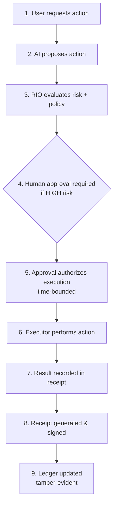

# RIO Receipt Protocol

[](https://github.com/bkr1297-RIO/rio-receipt-protocol/blob/main/LICENSE)
[](https://www.npmjs.com/package/rio-receipt-protocol)
[](https://pypi.org/project/rio-receipt-protocol/)
[-brightgreen.svg)](tests/conformance.test.mjs)
[](#)

**Cryptographic proof for AI actions. Open standard. Zero dependencies.**

Your AI does something. This protocol proves it happened, what was requested, what executed, and that the record hasn't been changed. It wraps around your existing system — you don't replace anything, you add a proof layer.

---

## Quick Start

### Install

```bash
# Node.js
npm install rio-receipt-protocol

# Python
pip install rio-receipt-protocol

# Docker (REST API — no install required)
docker run -p 3000:3000 ghcr.io/bkr1297-rio/rio-receipt-protocol
```

Or clone and use locally:

```bash
git clone https://github.com/bkr1297-RIO/rio-receipt-protocol.git
cd rio-receipt-protocol
node examples/basic-usage.mjs
```

Both packages have **zero required dependencies**. Node.js uses only `node:crypto` and `node:fs`. Python uses only the standard library.

### Generate Your First Receipt (Node.js)

```javascript
import {
  hashIntent, hashExecution, generateReceipt,
  verifyReceipt, createLedger
} from "rio-receipt-protocol";

// 1. Hash the intent (what was requested)
const intentHash = hashIntent({
  intent_id: "i-001", action: "send_email", agent_id: "agent-1",
  parameters: { to: "user@example.com", subject: "Hello" },
  timestamp: new Date().toISOString(),
});

// 2. Hash the execution (what actually happened)
const executionHash = hashExecution({
  intent_id: "i-001", action: "send_email",
  result: "sent", connector: "smtp",
  timestamp: new Date().toISOString(),
});

// 3. Generate a receipt binding both hashes
const receipt = generateReceipt({
  intent_hash: intentHash,
  execution_hash: executionHash,
  intent_id: "i-001",
  action: "send_email",
  agent_id: "agent-1",
});

// 4. Verify it
console.log(verifyReceipt(receipt).valid); // true

// 5. Write to a tamper-evident ledger
const ledger = createLedger();
ledger.append({
  intent_id: "i-001",
  action: "send_email",
  agent_id: "agent-1",
  status: "executed",
  detail: "Email sent",
  receipt_hash: receipt.hash_chain.receipt_hash,
});
console.log(ledger.verifyChain().valid); // true
```

### Generate Your First Receipt (Python)

```python
from rio_receipt_protocol import (
    hash_intent, hash_execution, generate_receipt,
    verify_receipt, create_ledger
)

# 1. Hash the intent
intent_hash = hash_intent(
    intent_id="i-001", action="send_email", agent_id="agent-1",
    parameters={"to": "user@example.com", "subject": "Hello"},
    timestamp="2026-04-01T00:00:00.000Z",
)

# 2. Hash the execution
execution_hash = hash_execution(
    intent_id="i-001", action="send_email",
    result="sent", connector="smtp",
    timestamp="2026-04-01T00:00:01.000Z",
)

# 3. Generate and verify a receipt
receipt = generate_receipt(
    intent_hash=intent_hash, execution_hash=execution_hash,
    intent_id="i-001", action="send_email", agent_id="agent-1",
)
assert verify_receipt(receipt)["valid"]

# 4. Write to a tamper-evident ledger
ledger = create_ledger()
ledger.append(
    intent_id="i-001", action="send_email", agent_id="agent-1",
    status="executed", detail="Email sent",
    receipt_hash=receipt["hash_chain"]["receipt_hash"],
)
assert ledger.verify_chain()["valid"]
```

Three hashes, one receipt, one ledger entry. Your AI system now produces verifiable proof of every action.

---

## The Mental Model

Every receipt follows the same four-step pattern:

```
1. Hash the intent       →  What was requested?
2. Hash the execution    →  What actually happened?
3. Generate the receipt  →  Bind them together (SHA-256)
4. Append to the ledger  →  Tamper-evident chain
```

```
Intent → Execution → Receipt → Ledger
  ↓          ↓           ↓         ↓
SHA-256   SHA-256     SHA-256   Hash Chain
```

That's it. Wrap any AI call, API action, or automated operation with these four steps and you have cryptographic proof of what happened. The receipt is independently verifiable by anyone — auditors, regulators, customers — without access to your system.

---

## Real-World Examples

The `examples/` directory contains complete, runnable demos for common AI actions:

| Example | What It Proves | Run It |
|---------|---------------|--------|
| **Email send** | AI sent an email, receipt proves sender, recipient, content hash | `node examples/send_email_demo.mjs` |
| **File delete** | AI deleted a file, receipt proves which file, when, by whom | `node examples/file_delete_demo.mjs` |
| **API call** | AI called an external API, receipt proves endpoint, payload, response | `node examples/api_call_demo.mjs` |
| **Money transfer** | AI moved funds, receipt proves amount, accounts, authorization | `node examples/money_transfer_demo.mjs` |
| **Database persistence** | Receipts stored in a database with query and retrieval | `node examples/database_persistence_demo.mjs` |
| **Key rotation** | Rotate signing keys while maintaining ledger continuity | `node examples/key_rotation_demo.mjs` |
| **Basic flow** | Minimal intent → receipt → ledger → verify | `node examples/basic-usage.mjs` |
| **End-to-end (Node.js)** | Full governed flow with signing and verification | `node examples/end-to-end.mjs` |
| **End-to-end (Python)** | Full governed flow in Python | `python examples/end-to-end.py` |

Each demo generates real receipts and ledger entries that you can inspect and verify with the CLI:

```bash
node cli/verify.mjs receipt ./demo-output/receipt.json
node cli/verify.mjs chain ./demo-output/ledger.json
```

---

## Where It Fits

The RIO Receipt Protocol is a **proof layer** that sits between your application and your storage. It does not replace anything in your stack — it wraps around your existing AI calls and API actions to produce verifiable receipts.

```
┌─────────────────────────────────────────────┐
│   Your Application / AI Agent               │  ← Your code (unchanged)
│   (OpenAI, Anthropic, LangChain, custom)    │
├─────────────────────────────────────────────┤
│   RIO Receipt Protocol                      │  ← Add this layer (4 function calls)
│   hashIntent → hashExecution → receipt →    │
│   ledger.append                             │
├─────────────────────────────────────────────┤
│   Your Storage / Database                   │  ← Your infrastructure (unchanged)
└─────────────────────────────────────────────┘
```

You keep your AI provider, your framework, your database, your deployment. The protocol adds four function calls to produce a cryptographic receipt for each action. That's the integration.

### Integration Template

Copy this template to add receipts to any action in your system:

```javascript
import {
  hashIntent, hashExecution, generateReceipt, verifyReceipt,
  generateKeyPair, signReceipt, createLedger,
} from "rio-receipt-protocol";

const keys = generateKeyPair();  // Generate once, store privateKeyObj securely
const ledger = createLedger();

async function executeWithReceipt(action, agentId, parameters, doAction) {
  const intentId = crypto.randomUUID();
  const intentHash = hashIntent({ intent_id: intentId, action, agent_id: agentId, parameters, timestamp: new Date().toISOString() });

  const result = await doAction(parameters);  // Your actual action

  const executionHash = hashExecution({ intent_id: intentId, action, result, connector: "my-system", timestamp: new Date().toISOString() });
  const receipt = generateReceipt({ intent_hash: intentHash, execution_hash: executionHash, intent_id: intentId, action, agent_id: agentId });
  signReceipt(receipt, { privateKey: keys.privateKeyObj, publicKeyHex: keys.publicKeyHex, signerId: "my-gateway" });
  ledger.append({ intent_id: intentId, action, agent_id: agentId, status: "executed", detail: action, receipt_hash: receipt.hash_chain.receipt_hash, intent_hash: intentHash });

  console.log("Receipt valid:", verifyReceipt(receipt).valid);
  return { result, receipt };
}
```

> **Key order matters.** When constructing objects for hashing, keys must be in the exact order shown. Different key orders produce different hashes. See [Canonical Rules](spec/canonical-rules.md) for details.

### Framework Integration

See the **[Integration Guide](docs/integration-guide.md)** for complete examples with:

- **OpenAI** (Node.js + Python)
- **Anthropic Claude** (Node.js + Python)
- **LangChain** (callback handler for automatic receipt generation)
- **Multi-agent systems** (shared ledger across agents)
- **Governed receipts** (human-in-the-loop 5-hash chains)

---

## What Is a RIO Receipt?

A RIO Receipt is a cryptographic record of an AI action, written to a tamper-evident ledger. It allows an organization to later prove exactly what an AI system did, when it did it, which system was responsible, and that the record has not been altered.

**A standard RIO Receipt proves:**

- What action was taken
- Which AI or system initiated it
- When it happened
- What the result was
- That the record has not been altered

When a governance layer is present (such as the full RIO platform), receipts can also prove whether a human approved the action and under what policy. But **the core protocol does not require governance or human approval** — it works as standalone proof infrastructure for any AI system.

Any AI system — whether built on OpenAI, Anthropic, Google, Cohere, open-source models, or custom agents — can implement RIO Receipts to produce a verifiable audit trail.

### Proof-Layer Receipt (Core)

The minimal receipt — proof of what happened, no governance required:

```json
{
  "receipt_id": "8494b6e4-f50e-4788-9a3f-50296f276263",
  "receipt_type": "action",
  "intent_id": "e3a19336-dd82-496f-812b-e6f1636e96f2",
  "action": "send_email",
  "agent_id": "copilot-agent-001",
  "authorized_by": null,
  "timestamp": "2026-04-01T20:15:00.000Z",
  "hash_chain": {
    "intent_hash": "a1b2c3...64 hex chars",
    "governance_hash": null,
    "authorization_hash": null,
    "execution_hash": "def012...64 hex chars",
    "receipt_hash": "345678...64 hex chars"
  },
  "verification": {
    "algorithm": "SHA-256",
    "chain_length": 3,
    "chain_order": ["intent_hash", "execution_hash", "receipt_hash"]
  }
}
```

The `receipt_hash` is computed from the `receipt_id`, the intent and execution hashes, and the `timestamp`. Changing any field invalidates the hash.

### Governed Receipt (Extension)

When governance and human approval are present, the receipt expands from a 3-hash chain to a 5-hash chain:

```
Core:     intent_hash → execution_hash → receipt_hash                              (3 hashes)
Governed: intent_hash → governance_hash → authorization_hash → execution_hash → receipt_hash  (5 hashes)
```

```json
{
  "receipt_type": "governed_action",
  "authorized_by": "HUMAN:cfo@example.com",
  "hash_chain": {
    "intent_hash": "a1b2c3...64 hex chars",
    "governance_hash": "d4e5f6...64 hex chars",
    "authorization_hash": "789abc...64 hex chars",
    "execution_hash": "def012...64 hex chars",
    "receipt_hash": "345678...64 hex chars"
  },
  "verification": {
    "algorithm": "SHA-256",
    "chain_length": 5,
    "chain_order": ["intent_hash", "governance_hash", "authorization_hash",
                    "execution_hash", "receipt_hash"]
  }
}
```

Both receipt types coexist in the same ledger. The verifier handles both automatically.

### Optional Extensions (v2.2, Backward Compatible)

**Ingestion Provenance** — tracks where the intent originated:

```json
"ingestion": {
  "source": "api",
  "channel": "POST /intent",
  "source_message_id": "msg-123",
  "timestamp": "2026-04-01T20:14:59.000Z"
}
```

**Identity Binding** — Ed25519 cryptographic signature proof:

```json
"identity_binding": {
  "signer_id": "human-root",
  "public_key_hex": "a1b2c3...64 hex chars",
  "signature_payload_hash": "d4e5f6...64 hex chars",
  "verification_method": "ed25519-nacl",
  "ed25519_signed": true
}
```

---

## The Ledger

The ledger is an append-only, hash-chained sequence of entries. Each entry contains:

| Field | Description |
|-------|-------------|
| `entry_id` | UUID for this entry |
| `prev_hash` | SHA-256 hash of the previous entry (genesis = 64 zeros) |
| `ledger_hash` | SHA-256 hash of this entry's canonical content |
| `timestamp` | ISO 8601 timestamp |
| `intent_id` | The intent this entry relates to |
| `action` | The action type |
| `agent_id` | The agent that requested the action |
| `status` | Entry status (submitted, executed, denied, blocked) |
| `detail` | Human-readable description |
| `receipt_hash` | Hash of the associated receipt (if applicable) |

The hash chain makes the ledger tamper-evident:

- **Modify** an entry → its hash changes → the next entry's `prev_hash` no longer matches
- **Delete** an entry → the chain breaks at the gap
- **Insert** an entry → the surrounding entries' hashes no longer link
- **Reorder** entries → `prev_hash` linkages break

The conformance tests verify all four tamper scenarios.

---

## The Verifier

The verifier CLI (`rio-verify`) is a standalone tool for independent verification:

```bash
# Verify a single receipt
rio-verify receipt ./my-receipt.json

# Verify a ledger hash chain
rio-verify chain ./ledger-export.json

# Verify multiple receipts
rio-verify batch ./receipts.json

# Cross-verify a receipt against its ledger entry
rio-verify cross ./receipt.json ./entry.json

# Verify a live RIO Gateway
rio-verify remote https://rio-gateway.onrender.com
```

All verification is performed locally using SHA-256. No data is sent to any external service. The verifier can be run by any third party — auditors, regulators, customers — without access to the original system.

---

## Who This Is For

**Any team deploying AI agents** that needs to prove what their AI systems did. The proof layer works regardless of which AI provider, framework, or orchestration system you use.

**Enterprise teams** that need cryptographic audit trails for compliance (SOC 2, ISO 27001, GDPR Article 22, EU AI Act).

**AI platform builders** who want to add verifiable proof to their agent frameworks without building the proof layer from scratch.

**Consultants and integrators** building AI workflows for clients who need accountability and audit trails.

**Auditors and regulators** who need to independently verify AI action records without trusting the system that produced them.

---

## What You Can Build With This

- **Audit trail for AI agents** — Every action your AI takes gets a receipt. Every receipt goes on the ledger. You can prove the full history.
- **Compliance infrastructure** — Plug receipts into your SOC 2 / ISO 27001 / EU AI Act evidence pipeline.
- **Customer-facing proof** — Show your customers verifiable proof of what your AI did on their behalf.
- **Multi-agent accountability** — When multiple AI agents collaborate, each action gets its own receipt. The ledger shows who did what.
- **Governance layer** (with extension) — Add human approval workflows on top of the proof layer. The full RIO platform does this.

---

## Why This Exists

AI systems are making real decisions — sending emails, moving money, modifying records, scheduling meetings, writing code. Today, there is no standard way to prove any of it happened the way it was supposed to.

Prompt-level guardrails are bypassable. Policy documents are advisory. Audit logs can be incomplete or fabricated after the fact. Without a proof layer that is architecturally separate from the AI itself, every deployed agent is a liability.

The RIO Receipt Protocol gives every AI action a cryptographic receipt — a hash-chained proof that the action occurred as recorded. The receipt is written to a tamper-evident ledger where any modification, deletion, insertion, or reordering is immediately detectable.

This is not a framework. It is not a product. It is a **protocol** — a set of rules for how receipts are structured, hashed, chained, and verified. Any system can implement it.

---

## RIO Governance & Execution Loop

When the full RIO platform is used, every action follows this 9-step flow:



LOW-risk actions skip step 4 (auto-approved). HIGH-risk actions always require step 4 (explicit cryptographic approval).

**Result: Every action is provable. No Receipt = Did Not Happen.**

> **Note:** The governance loop is an optional extension. The core receipt protocol (steps 7–9) works without governance. You can add governance later when your system needs it.

---

## Conformance

The conformance test suite validates 8 categories across Node.js and Python (58 tests total):

| Suite | Tests | What It Proves |
|-------|-------|----------------|
| Proof-Layer Receipts | 5 | Core 3-hash receipts generate and verify correctly |
| Governed Receipts | 4 | Extended 5-hash receipts with governance/authorization |
| Hash Integrity | 5 | SHA-256 produces correct, deterministic output; tampering detected |
| Ledger Operations | 5 | Genesis linkage, multi-entry chains, standalone verifier agreement |
| Cross-Verification | 2 | Receipt-to-ledger matching and mismatch detection |
| Batch Verification | 2 | Multi-receipt verification with tamper detection |
| Mixed Receipt Types | 2 | Proof-layer and governed receipts coexist in one ledger |
| Optional Extensions | 3 | Ingestion provenance, identity binding, backward compatibility |

```bash
# Run conformance tests
node tests/conformance.test.mjs                          # Node.js (29 tests)
cd python && PYTHONPATH=. python3 tests/test_conformance.py  # Python (29 tests)
```

Any implementation of the RIO Receipt Protocol can run these tests to prove conformance. The test suite is the contract.

---

## Relationship to the RIO System

This protocol is the **open proof layer**. The [RIO System](https://github.com/bkr1297-RIO/rio-system) is the full governance platform built on top of it:

| Layer | What It Does | Status |
|-------|-------------|--------|
| **RIO Receipt Protocol** (this repo) | Receipt schema, ledger, verifier, conformance tests | **Open standard** |
| **RIO Gateway** | Full governance pipeline with policy engine, RBAC, Ed25519 signing | Reference implementation |
| **RIO Corpus** | Constitutional governance documents, policies, role definitions | Governing framework |
| **ONE Interface** | Human-in-the-loop approval, dashboard, agent management | Commercial platform |

You can use the receipt protocol without the gateway. You can use the gateway without ONE. Each layer is independently useful.

In simple terms:
- **Receipts prove** (open — this repo)
- **Ledger remembers** (open — this repo)
- AI proposes (application layer)
- Governance decides (commercial)
- Humans approve when required (commercial)
- Connectors execute (commercial)

---

## For Platform Builders

The RIO Receipt Protocol defines the proof layer for AI actions. If you are building an AI agent platform, an orchestration framework, or a governance system, you can adopt this protocol as your audit trail standard.

The receipt schema, ledger format, and verification rules are open. The conformance tests are the contract — if your system passes the tests, your receipts are interoperable with every other conforming implementation.

For teams that need the full governance pipeline — policy engine, risk assessment, human approval workflows, execution control, and enterprise dashboard — the RIO Platform provides these as a commercial layer built on top of this open protocol.

**Contact:** [riomethod5@gmail.com](mailto:riomethod5@gmail.com)

---

## Security Properties

The protocol provides the following security guarantees:

**Tamper evidence** — Any modification to a receipt or ledger entry is detectable by recomputing the SHA-256 hash.

**Chain integrity** — The hash chain ensures entries cannot be inserted, deleted, or reordered without breaking the linkage.

**Independent verification** — Any third party can verify receipts and chains using only the verifier and the data. No access to the original system is required.

**Non-repudiation** (with Ed25519 extension) — When identity binding is used, the signer cannot deny having authorized the action.

**Backward compatibility** — v2.2 extensions (ingestion, identity_binding, governed receipts) are optional. Core proof-layer receipts remain valid.

### Scope Limitations

This protocol does **not** guarantee:

**Honest signers** — The protocol proves that a specific key signed a receipt. It cannot prove the signer was truthful about what happened.

**Real-world truth** — A receipt records what the system claims occurred. It does not independently verify that the action happened in the physical world.

**Trustworthy operators** — The ledger operator controls append access. A malicious operator could withhold entries (detectable by gap analysis) or run a parallel ledger.

**Key security** — If a signing key is compromised, the attacker can produce valid signatures. Key management (rotation, revocation, HSM storage) is outside protocol scope.

**Correct governance** — The protocol records governance decisions. It does not evaluate whether those decisions were wise, ethical, or correct.

These limitations are inherent to any cryptographic proof system. External witnesses, public anchoring (Merkle roots, RFC 3161 timestamps), and multi-party signing can mitigate some of them.

---

## Specification Documents

The formal protocol specifications are in the `spec/` directory:

- **[receipt-protocol.md](spec/receipt-protocol.md)** — Full protocol specification: receipt structure, hash computation, lifecycle
- **[receipt-schema.json](spec/receipt-schema.json)** — JSON Schema defining the receipt format, required and optional fields, types, and constraints
- **[ledger-format.md](spec/ledger-format.md)** — Ledger entry structure, hash chain rules, genesis hash, canonical field ordering
- **[signing-rules.md](spec/signing-rules.md)** — Signing algorithms, key management, verification procedures, Ed25519 requirements
- **[canonical-rules.md](spec/canonical-rules.md)** — Canonical JSON serialization rules and required field ordering for each hash function
- **[conformance.md](spec/conformance.md)** — Conformance levels, test requirements, and interoperability criteria

These documents define the protocol independent of the reference implementation. Any language or platform can implement the protocol by following these specs and passing the conformance tests.

---

## What Is in This Repo

```
rio-receipt-protocol/
├── index.mjs                        # npm package entry point (unified exports)
├── index.d.ts                       # TypeScript type declarations
├── package.json                     # npm package configuration
├── Dockerfile                       # Production container (API server, CLI, tests)
├── docker-compose.yml               # Docker Compose for one-command startup
├── spec/                            # The protocol specification
│   ├── receipt-protocol.md          # Full protocol specification
│   ├── receipt-schema.json          # JSON Schema for RIO Receipts (v2.2)
│   ├── ledger-format.md            # Ledger hash chain specification
│   ├── signing-rules.md            # Signing and verification rules
│   ├── canonical-rules.md          # Canonical JSON serialization rules
│   └── conformance.md              # Conformance levels and test requirements
├── reference/                       # Reference implementation (Node.js, zero dependencies)
│   ├── receipts.mjs                # Receipt generation and verification
│   ├── ledger.mjs                  # Tamper-evident ledger (in-memory + JSON file)
│   ├── verifier.mjs                # Standalone verification (receipts, chains, cross-checks)
│   ├── web_verifier.js             # Browser-compatible verifier (Web Crypto API)
│   ├── sign_receipt.py             # Python Ed25519 signing reference
│   ├── verifier.py                 # Python standalone verifier
│   └── verify_receipt_py.py        # Python receipt verification reference
├── python/                          # Python package (pip install rio-receipt-protocol)
│   ├── rio_receipt_protocol/       # Python module (zero required dependencies)
│   ├── tests/                      # Python conformance tests (29 tests)
│   └── pyproject.toml              # PyPI packaging configuration
├── cli/                             # Command-line tools
│   ├── verify.mjs                  # rio-verify CLI (receipt, chain, batch, cross, remote)
│   └── demo.mjs                    # Interactive demo script
├── docker/                          # Docker quickstart (lightweight REST API wrapper)
│   ├── server.mjs                  # REST API server
│   ├── Dockerfile                  # Lightweight container
│   ├── docker-compose.yml          # Docker Compose
│   └── README.md                   # Docker quickstart guide
├── docs/                            # Documentation
│   ├── integration-guide.md        # OpenAI, Anthropic, LangChain integration examples
│   ├── architecture.md             # Architecture diagram and protocol positioning
│   ├── rio-overview.md             # Full RIO system overview
│   ├── FAQ.md                      # Frequently asked questions
│   └── landing_page_content.md     # Protocol website content
├── tests/                           # Node.js conformance test suite
│   ├── conformance.test.mjs        # 29 tests across 8 categories
│   └── legacy/                     # Pre-v2.2 tests (Ed25519 signing)
├── examples/                        # Usage examples and demos
│   ├── basic-usage.mjs             # Minimal flow: intent → receipt → ledger → verify
│   ├── send_email_demo.mjs         # AI sends email — receipt proves it
│   ├── file_delete_demo.mjs        # AI deletes file — receipt proves it
│   ├── api_call_demo.mjs           # AI calls API — receipt proves it
│   ├── money_transfer_demo.mjs     # AI transfers money — receipt proves it
│   ├── database_persistence_demo.mjs # Receipts stored in database
│   ├── key_rotation_demo.mjs       # Signing key rotation
│   ├── end-to-end.mjs              # Full governed flow (Node.js)
│   ├── end-to-end.py               # Full governed flow (Python)
│   ├── sample_receipt_valid.json   # Valid proof-layer receipt
│   ├── sample_receipt_governed.json # Valid governed receipt (5-hash)
│   ├── sample_receipt_invalid.json # Tampered receipt (for testing)
│   └── sample_ledger.json          # Sample ledger with hash chain
├── CHANGELOG.md                     # Version history
├── CONTRIBUTING.md                  # Contribution guidelines
├── CODE_OF_CONDUCT.md               # Contributor Covenant v2.1
├── SECURITY.md                      # Security policy and vulnerability reporting
├── LICENSE-MIT                      # MIT license
└── LICENSE-APACHE                   # Apache 2.0 license
```

---

## Architecture

For a visual overview of where the RIO Receipt Protocol sits in a system, see the **[Architecture Diagram](docs/architecture.md)** and the **[RIO System Overview](docs/rio-overview.md)**. The protocol is the middle layer — it does not care what is above it (any AI provider) or below it (any storage backend). It produces verifiable receipts.

---

## Contributing

Contributions are welcome. See **[CONTRIBUTING.md](CONTRIBUTING.md)** for how to run tests, report bugs, propose spec changes, and submit pull requests.

This project follows the **[Contributor Covenant Code of Conduct](CODE_OF_CONDUCT.md)**.

For security vulnerabilities, see **[SECURITY.md](SECURITY.md)**.

---

## License

Dual-licensed under MIT and Apache 2.0. Use whichever fits your project.
