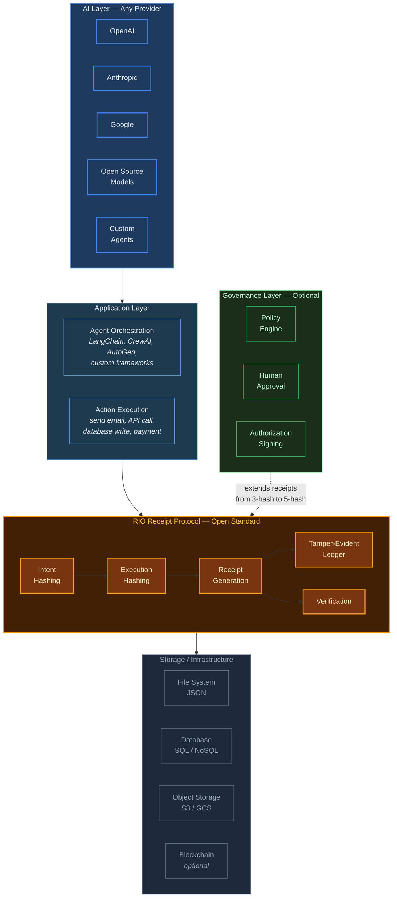

# RIO Receipt Protocol — Architecture

The diagram below shows where the RIO Receipt Protocol sits in a system. The protocol is the middle layer. It does not care what is above it (any AI provider, any agent framework) or below it (any storage backend, any governance system). It produces verifiable receipts.

## Key Points

The RIO Receipt Protocol is **provider-agnostic**. It works with any AI system — OpenAI, Anthropic, Google, open-source models, or custom agents. The protocol does not interact with the AI layer directly; it operates on the outputs (intents and execution results) that the application layer produces.

The protocol is **storage-agnostic**. Receipts and ledger entries are JSON objects. They can be stored in files, databases, object storage, or even a blockchain. The protocol defines the format and the verification rules, not where the data lives.

The governance layer is **optional**. Without it, the protocol produces 3-hash proof-layer receipts (intent, execution, receipt). With it, the protocol produces 5-hash governed receipts that additionally prove governance evaluation and human authorization occurred.

## Receipt Flow

```mermaid
sequenceDiagram
    participant AI as AI Agent
    participant App as Application
    participant Proto as RIO Receipt Protocol
    participant Ledger as Tamper-Evident Ledger

    AI->>App: Propose action
    App->>Proto: Hash intent
    App->>App: Execute action
    App->>Proto: Hash execution
    Proto->>Proto: Generate receipt<br/>(bind intent + execution hashes)
    Proto->>Proto: Verify receipt
    Proto->>Ledger: Append to hash chain
    Ledger-->>App: Ledger entry with prev_hash linkage
```

The entire flow — from intent to ledger entry — happens in milliseconds. The receipt is generated locally using SHA-256. No external service calls are required.
